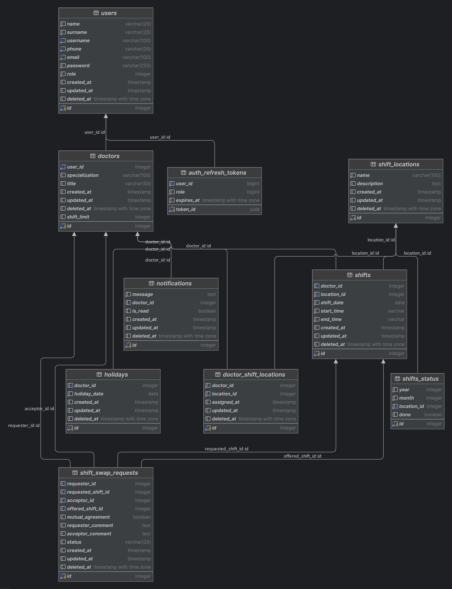

# Doctor Shift Planning and Management System Project Documentation

## 1. Project Description
This project aims to automate the shift planning for hospital doctors, organize shifts based on their availability, and simplify the management of shift exchange requests.

## 2. Objectives and Goals

- Create fair shift schedules for doctors.
- Plan shifts considering the availability provided by doctors.
- Manage leave requests for specific days or time slots.
- Provide a notification system for doctors to easily request shift exchanges.

---

## 3. Project Architecture

### 3.1 Technologies
- **Backend:** Go
- **Mobile Application:** Flutter or Kotlin
- **Frontend (Optional):** Vue.js
- **Database:** PostgreSQL
- **Docker**
- **Redis (Cache)**
---

## 4. Database Structure

### 4.1 Tables

1. **Doctors (‘doctors’):**
    - Stores doctor information.

2. **Shifts (‘shifts’):**
    - Records which doctor is on duty on specific days.

3. **Availability (‘holidays’):**
    - Logs the days doctors wish to take leave.

4. **Shift Swap Requests (‘shift_swap_requests’):**
    - Keeps track of doctors’ shift exchange requests.

5. **Notifications (‘notifications’):**
    - Sends notifications to all users.

---

## 5. Algorithm

### 5.1 Shift Planning

1. **Input:**
    - Doctors’ availability information (days and hours).
    - The number of shifts to be assigned.
    - Daily shift hours.

2. **Steps:**
    1. Retrieve doctors’ availability data.
    2. The number of shifts for each day is divided according to seniority.
    3. Exclude unavailable doctors and distribute shifts among available doctors fairly.

3. **Output:**
    - A shift list is created for each doctor, according to seniority and by assigning shifts except for the days he/she wants to be on holiday.

### 5.2 Shift Swap Requests

1. A doctor creates a request to exchange their shift.
2. The request is sent as a notification to other available doctors.
3. A doctor accepts the request, and the system updates the shift information.
4. Notifications are sent to all parties upon completion of the exchange.

---

## 6. User Scenarios

### Scenario 1: Shift Planning
1. The administrator enters all doctors’ availability into the system.
2. The system runs the algorithm and generates a monthly shift schedule.
3. Doctors view their shift schedules via the application.

### Scenario 2: Shift Exchange Request
1. Doctor A creates a shift exchange request for a specific day.
2. The system sends the request to other doctors with matching availability.
3. Doctor B accepts the request.
4. The system updates the shifts and sends notifications to all parties.

Example Scenario:
- Doctor A (requester): Wants to exchange their shift on January 5, 2025 (shift_id: 101).
- Doctor B (acceptor): Offers their shift on January 10, 2025 (shift_id: 202).
- If both parties agree:
    - Doctor A takes the January 10 shift.
    - Doctor B takes the January 5 shift.

The table entry would look like this:

### Example Shift Swap Requests Table

| `id` | `requester_id` | `requested_shift_id` | `acceptor_id` | `offered_shift_id` | `status`   | `requester_comment`              | `acceptor_comment`            | `mutual_agreement`  |
|------|----------------|----------------------|---------------|--------------------|------------|---------------------------------|-------------------------------|---------------------|
| 1    | 101            | 201                  | 102           | 202                | pending    | "I want to exchange my shift." | "This shift works for me."   | FALSE               |
| 2    | 103            | 203                  | 104           | 204                | accepted   | "I have an urgent matter."     | "I can take this shift."     | TRUE                |

### Explanations

1. **Row 1:**
    - `requester_id` = 101 requested to exchange `requested_shift_id` = 201.
    - `acceptor_id` = 102 proposed their shift (`offered_shift_id` = 202).
    - The request is still **pending**.

2. **Row 2:**
    - `requester_id` = 103 successfully exchanged `requested_shift_id` = 203.
    - `acceptor_id` = 104 agreed to swap with their `offered_shift_id` = 204.
    - The request is **accepted** and both parties gave **mutual_agreement**.

---

## 7. Technical Details

### 7.1 API Endpoints
- **GET /doctors:** List all doctors.
- **POST /shifts:** Create a shift plan.
- **POST /holidays:** Add doctor leave days.
- **POST /shift_swap_requests:** Submit a shift exchange request.
- **POST /notifications:** Send notifications.

---

## 8. Conclusion
This project provides hospital administrators with an efficient system to plan shifts, ensuring fair allocation by considering doctors’ availability. Shift exchange requests aim to improve working conditions for doctors and foster a more collaborative environment.

