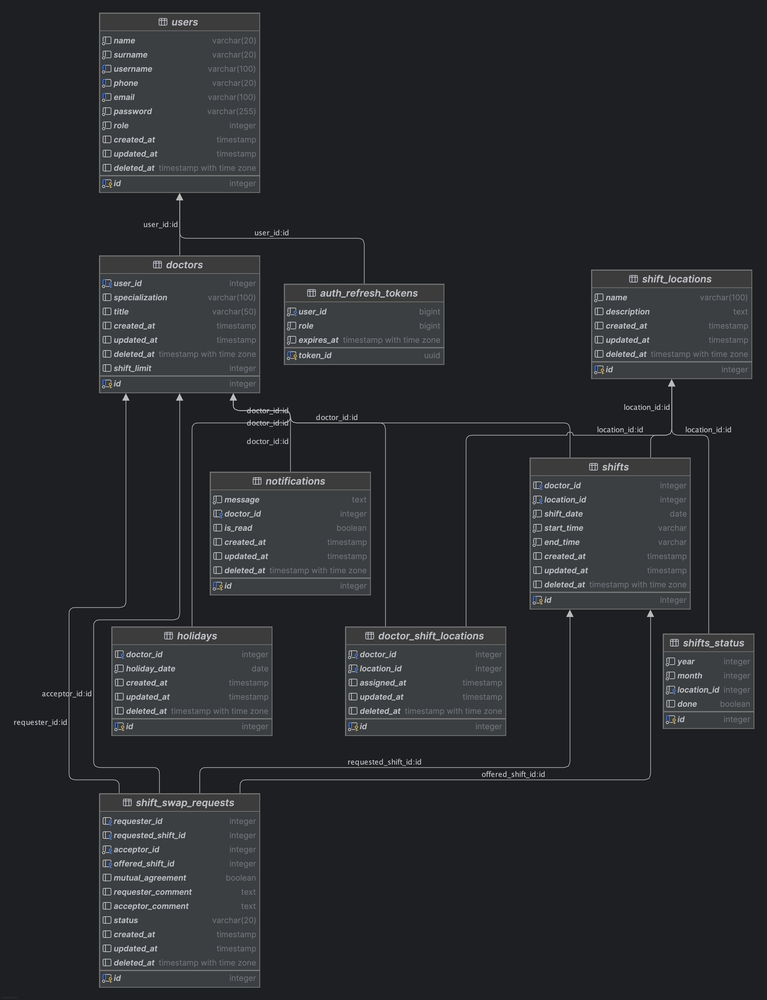

# Doktor Nöbet Planlama ve Yönetim Sistemi Proje Dökümantasyonu

## 1. Proje Tanımı Ve Videosu
Bu proje, hastanelerde çalışan doktorların nöbet planlamasının otomatik olarak yapılması, nöbetlerin doktorların müsaitlik durumlarına göre düzenlenmesi ve nöbet değişim taleplerinin kolayca yönetilebilmesini sağlamak için geliştirilecektir.

### Proje Önizleme Videosu:  

https://github.com/user-attachments/assets/6564f590-9d83-4d69-af4d-1db7b8ba2c56

## 2. Amaç ve Hedefler

- Doktorların nöbet planlarını adil bir şekilde oluşturmak.
- Doktorların belirttiği müsaitlik zamanlarını dikkate alarak nöbet planı yapmak.
- Belirli bir gün ya da saat aralığında izin isteyen doktorların taleplerini yönetmek.
- Doktorlar arasında nöbet değişim taleplerini kolayca yapabilmek için bir bildirim sistemi sunmak.

---

## 3. Proje Mimarisi

### 3.1 Teknolojiler
- **Backend:** Go
- **Mobil Uygulama:** Flutter veya Kotlin
- **Frontend (Opsiyonel):** Vue.js
- **Veritabanı:** PostgreSQL
- **Docker Ve Docker Compose**
- **Redis (Cache)**

---

## 4. Veri Tabanı Yapısı

### 4.1 Tablolar

1. **Doktorlar (‘doctors’):**
    - Doktorların bilgilerini tutar.

2. **Nöbetler (‘shifts’):**
    - Hangi doktorun hangi gün nöbetçi olduğunu saklar.

3. **Müsaitlik (‘holidays’):**
    - Doktorların hangi günlerde tatil yapmak istediklerini kaydeder.

4. **Nöbet Değişim Talepleri (‘shift_swap_requests’):**
    - Doktorların nöbet değişim isteklerini kayıt altına alır.

5. **Bildirimler (‘notifications’):**
    - Tüm kullanıcılara bildirim gönderir.

---

## 5. Algoritma

### 5.1 Nöbet Planlama
1. **Girdi:**
    - Doktorların müsaitlik bilgileri (gün ve saat).
    - Belirlenen nöbet sayısı.
    - Günlük nöbet saati.

2. **Adımlar:**
    1. Doktorların müsaitlik durumları alınır.
    2. Her gün için nöbet sayısı kıdemlere göre paylaştırılır.
    3. Müsait olmayan doktorlar çıkarılır ve müsait olan doktorlar arasında dengeli bir dağılım yapılır.

3. **Çıktı:**
    - Her doktor için, kıdemlere göre ve tatil olmasını istediği günler dışında nöbet verilerek nöbet listesi oluşturulur.

### 5.2 Nöbet Değişim Talepleri
1. Doktor, nöbetiyle ilgili değişim isteği oluşturur.
2. Bu istek, diğer doktorlara bildirim olarak gönderilir.
3. Kabul eden doktor talebi onaylar ve sistemde nöbet bilgileri güncellenir.
4. Değişim tamamlandığında tüm taraflara bildirim gönderilir.

---

## 6. Kullanıcı Senaryoları

### Senaryo 1: Nöbet Planlama
1. Yönetici, tüm doktorların müsaitlik bilgilerini sisteme girer.
2. Sistem algoritmayı çalıştırır ve bir aylık nöbet planı oluşturur.
3. Doktorlar, uygulama üzerinden nöbet planlarını görür.

### Senaryo 2: Nöbet Değişim Talebi
1. Doktor A, belirli bir gün için nöbet değişim talebi oluşturur.
2. Sistem, bu talebi uygun müsaitlikteki doktorlara gönderir.
3. Doktor B talebi kabul eder.
4. Sistem, doktorların nöbetlerini günceller ve tüm taraflara bildirim gönderir.

Örnek Senaryo:
- Doktor A (requester): 5 Ocak 2025 tarihindeki nöbetini bırakmak istiyor (shift_id: 101).
- Doktor B (acceptor): 10 Ocak 2025 tarihindeki nöbetini teklif ediyor (shift_id: 202).
- Eğer her iki taraf da mutabakata varırsa:
    - Doktor A, 10 Ocak nöbetini alır.
    - Doktor B, 5 Ocak nöbetini alır.
      Tablodaki kayıt şu şekilde görünür:

### Örnek Shift Swap Requests Tablosu

| `id` | `requester_id` | `requested_shift_id` | `acceptor_id` | `offered_shift_id` | `status`   | `requester_comment`              | `acceptor_comment`            | `mutual_agreement`  |
|------|----------------|----------------------|---------------|--------------------|------------|-----------------------------     |---------------------------    |---------------------|
| 1    | 101            | 201                  | 102           | 202                | pending    | "Nöbetimi değiştirmek istiyorum."| "Bu nöbet benim için uygun."  | FALSE               |
| 2    | 103            | 203                  | 104           | 204                | accepted   | "Acil bir işim çıktı."           | "Tamam, bu nöbeti alabilirim."| TRUE                |

### Açıklamalar

1. **Satır 1**:
    - `requester_id` = 101 olan doktor, `requested_shift_id` = 201 nöbetini değiştirmek istiyor.
    - `acceptor_id` = 102 olan doktor, bu talebi değerlendiriyor ve kendi nöbeti olan `offered_shift_id` = 202'yi öneriyor.
    - Talep hâlâ **pending** durumunda.

2. **Satır 2**:
    - `requester_id` = 103 olan doktor, `requested_shift_id` = 203 nöbetini değiştirdi.
    - `acceptor_id` = 104 olan doktor, kendi nöbeti olan `offered_shift_id` = 204 ile değişime razı oldu.
    - Talep **accepted** olarak işaretlendi ve her iki taraf **mutual_agreement** onayı verdi.

---

## 7. Teknik Detaylar

### 7.1 API Son Noktaları
- **GET /doctors:** Tüm doktorları listeleme.
- **POST /shifts:** Nöbet planı oluşturma.
- **POST /holidays:** Doktor tatil günü ekleme.
- **POST /shift_swap_requests:** Nöbet değişim talebi gönderme.
- **POST /notifications:** Bildirim gönderme.

---

## 8. Sonuç
Bu proje sayesinde hastane yöneticileri nöbet planlamasını daha etkin bir şekilde yapabilecek, doktorların müsaitlik durumlarının dikkate alınmasıyla adil bir sistem sağlanacaktır. Nöbet değişim talepleri ile doktorların çalışma koşulları iyileştirilecektir.

